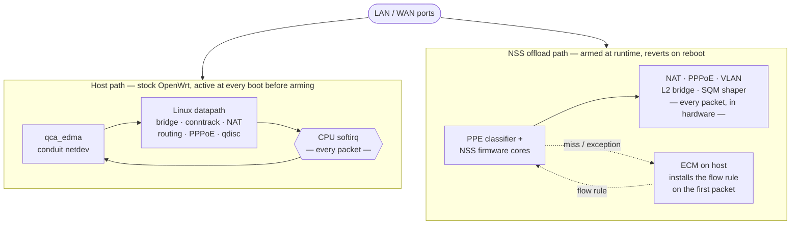

# OpenWrt with Qualcomm NSS hardware offload on the upstream EDMA driver

OpenWrt for **IPQ807x** (Qualcomm IPQ8074 / IPQ8071A) that runs **NSS network
offload** — the two UBI32 packet-processing cores in the SoC — on top of OpenWrt
main's **upstream `qca_edma` / `qca_ppe` ethernet and DSA drivers** from
[openwrt/openwrt#22381](https://github.com/openwrt/openwrt/pull/22381).

Every other NSS build replaces the ethernet stack with Qualcomm's out-of-tree
`qca-nss-dp` + `qca-ssdk` drivers. This tree keeps the upstream drivers and
attaches the NSS firmware to them through a small glue module — the first NSS
integration to do so.

Validated on the **Xiaomi AX3600** (IPQ8071A, 512 MB, PPPoE uplink):

| Workload | Host path | NSS offloaded |
|---|---|---|
| NAT + PPPoE routing @ ~310 Mbit/s | ~42 % of one core (softirq) | **99.7 % CPU idle** |
| SQM shaping @ 285 Mbit | CPU-bound on this class of SoC | **99 % idle, 16 ms RTT under full load — no bufferbloat** |

## How traffic flows: host path vs NSS offload

After a plain reboot the router is **stock OpenWrt** — the CPU forwards every
packet. The NSS data plane is armed explicitly at runtime; once it is up the
firmware forwards established flows in hardware and the CPU only sees the first
packet of each flow plus exceptions (broadcast/multicast, locally-bound, new
connections). Every boot comes up on the host-only stack first; the `nss`
service then arms the plane unless it is disabled.



## Documentation

The [project wiki](https://github.com/JuliusBairaktaris/openwrt-nss-edma/wiki)
covers the architecture, the firmware and source-pin rationale, the runtime
bring-up sequence and its safety rules, SQM, hardware support and the
limitations. New to NSS offload? Start with
[NSS Offload Explained](https://github.com/JuliusBairaktaris/openwrt-nss-edma/wiki/NSS-Offload-Explained),
which builds the concept up from scratch.

## Branch layout (`nss-edma-rework`)

The branch layers cleanly on upstream:

1. [openwrt/openwrt](https://github.com/openwrt/openwrt) `main`, which now
   carries the `qca_edma` / `qca_ppe` ethernet and DSA driver rework
   ([PR #22381](https://github.com/openwrt/openwrt/pull/22381), merged) — so the
   base is stock OpenWrt, no out-of-tree driver branch to track.
2. A kernel **6.18** uplift of the `qualcommax` target (upstream is still on
   6.12): the 6.18 patch set and config, plus the phylink/stmmac driver-API
   adaptations the newer kernel needs.
3. The NSS integration series: ramoops crash forensics; the NSS device-tree
   nodes for the IPQ807x boards; the `qca_edma` shared-EDMA hardening and TX/RX
   redirect hooks; per-port firmware VSIs and bridge-mgr exports in `qca_ppe`;
   the `kmod-qca-ppe-nss` glue module (with the `qca-nss-drv` probe gate); the
   ECM and NSS-qdisc kernel support patches; iproute2 `tc` support for the NSS
   qdiscs; the qca-mcs multicast snooping hooks (`0971`); the ath11k/mac80211
   Wi-Fi-offload patches; and staging for nat46/MAP-T.

The NSS packages (driver, ECM, qdisc/PPPoE managers, firmware, SQM script) live
in the companion feed
**[nss-packages](https://github.com/JuliusBairaktaris/nss-packages)**, branch
`edma-nss`.

## Prebuilt images

**[Qualcommax_NSS_Builder](https://github.com/JuliusBairaktaris/Qualcommax_NSS_Builder)**
builds this tree and the feed automatically whenever either moves. Grab the
latest `edma-nss-*` tag from its
[Releases](https://github.com/JuliusBairaktaris/Qualcommax_NSS_Builder/releases).
Building from source is only needed to change something.

## Quick start

```sh
git clone -b nss-edma-rework https://github.com/JuliusBairaktaris/openwrt-nss-edma.git
cd openwrt-nss-edma

# Start from the stock feeds and add the NSS feed. It provides kmod-qca-nss-drv
# etc.; without it ATH11K_NSS_SUPPORT has an unmet dependency and menuconfig
# aborts with a "recursive dependency".
cp feeds.conf.default feeds.conf
echo "src-git nss https://github.com/JuliusBairaktaris/nss-packages.git;edma-nss" >> feeds.conf

./scripts/feeds update -a && ./scripts/feeds install -a
./scripts/feeds list -r nss | grep -q qca-nss-drv && echo "nss feed OK"

make menuconfig   # target qualcommax/ipq807x; select the NSS packages;
                  # NSS_MEM_PROFILE_MEDIUM for 512 MB boards
make -j$(nproc)
```

With the offload disabled (`uci set nss.general.enabled='0'`) the image boots
as a completely normal OpenWrt system on the plain host stack — **no NSS
kernel module autoloads and the firmware never enters the boot-critical
path**; wired EDMA networking never depends on the NSS stack in any mode.
With the offload enabled (the default), the `nss-tools` package's `nss`
service makes the data-path decision once, before netifd: it arms the wired
plane, boots the firmware, applies the pbuf tuning, and loads ath11k with
`nss_offload` already set — the radios bind once, directly onto their data
path, with no later Wi-Fi rebind and exactly one WCSS remoteproc boot. If
arming fails, the boot continues on the host stack. ath11k has no module
autoload in this tree: the `nss` service brings Wi-Fi up on either path
(images built without `nss-tools` must load ath11k_ahb themselves). See
[Runtime Operation](https://github.com/JuliusBairaktaris/openwrt-nss-edma/wiki/Runtime-Operation)
for the sequence and the safety rules.

The tooling derives its targets at runtime — wired ports from the live DSA
topology, the WAN interface from the default route, the SQM section by type —
so it works unmodified on any ipq807x board and network config. Receive
steering needs no per-board target either: it is applied to every delivery
netdev at rx-queue creation through `net.core.rps_default_mask`.

The only deliberate assumption: when the WAN is down and the default route
can't identify it, `nss-up` and `nssqos` fall back to the conventional logical
interface name `wan` (nssqos offers a `wan_device` override).

## NSS offload support matrix

What the firmware data plane accelerates on this stack (whole IPQ807x family).
Legend: ✅ offloaded & validated · 🟨 supported in code, opt-in, not validated
here · ⬜ deliberately not carried (software path is used) · ❌ not available on
this platform/firmware.

| Feature | IPQ807x | Notes |
|---|:---:|---|
| IPv4 NAT / routing | ✅ | ECM, line rate, host ~idle |
| IPv6 routing | ✅ | ECM |
| PPPoE (incl. over 802.1Q VLAN) | ✅ | validated on a PPPoE/VLAN WAN |
| 802.1Q VLAN | ✅ | ECM VLAN-tagged flows |
| SQM shaper (nsstbl + nssfq_codel) | ✅ | `nss-edma.qos`; zero-bufferbloat verified |
| Ingress shaping (IGS / nssmirred) | ✅ | `act_nssmirred` → ifb |
| DSCP / mark classification | ✅ | ECM DSCP + mark classifiers |
| CoDel ECN marking | ❌ | the 12.5 firmware does not ECN-mark (verified at firmware level); 11.4 not verified |
| Wi-Fi AP (wifili) | ✅ | both radios (QCN5024 + QCN5054) |
| Wi-Fi STA | 🟨 | wifili path present; AP is what's validated |
| Wi-Fi WDS | 🟨 | not validated |
| Wi-Fi mesh | ✅¹ | offloaded with the NSS firmware 11.4 build option (`ATH11K_NSS_MESH_SUPPORT`); on the default 12.5 firmware mesh stays on the host path |
| Wi-Fi AP-VLAN | ❌ | broken in the ath11k driver |
| Bridge (wired LAN, same-subnet L2) | ✅ | `nss-bridge-mgr`; firmware hardware-bridges the wired ports (host idle). Wi-Fi members stay host-side until Wi-Fi offload |
| Inter-subnet routing (two subnets on one bridge) | ✅ | same-bridge hairpin route `lan1→lan2` accelerated (`accel_mode=2`, host flat), no config change |
| Multicast (same-subnet / bridged) | ✅ | `qca-mcs` snooping; PPE hardware-bridges to snooped members, host flat |
| Multicast (routed across subnets) | 🟨 | ECM `mc_create` path + kernel ipmr hooks built; needs a multicast-routing daemon (igmpproxy/smcroute) and a two-VIF topology |
| GRE | ❌ | not supported: never validated here, so the ECM interface types are forced off regardless of `kmod-gre` / `kmod-gre6` |
| MAP-T / DS-Lite | 🟨 | needs `kmod-nat46` |
| 6RD / IPIP6 (SIT) | ❌ | not supported: never validated here, so the ECM interface types are forced off regardless of `kmod-sit` / `kmod-ip6-tunnel` |
| VXLAN | ❌ | not supported: no ECM interface support is carried |
| OVS bridge | ⬜ | `nss-bridge-mgr` OVS path compiled out; would need `kmod-qca-ovsmgr` |
| MACVLAN | ❌ | not supported: no ECM interface support and no kernel hook is carried |
| L2TPv2 / PPTP | ❌ | not supported: the QCA kernel hooks are not ported, and the ECM interface is forced off. Enabling `ECM_INTERFACE_L2TPV2_ENABLE` will not build. |
| Bonding / LAG | ⬜ | kernel bonding hooks not carried |
| IPsec (ESP) | ❌ | not viable on IPQ807x; `nss-crypto`/`cfi` not carried |
| TLS / DTLS / CAPWAP | ❌ | not supported (matches the vendor matrix) |

The one opt-in row is build-verified against this tree: selecting `kmod-nat46`
turns MAP-T/DS-Lite ECM interface support on and links cleanly.

The rows marked not supported are forced off in the ECM package rather than
left to whichever kmods happen to be selected, because an interface type that
is enabled but never exercised is worse than one that is off: it changes how
ECM classifies flows with nobody having checked the result. Bonding/LAG,
6RD/IPIP6, GRE, VXLAN and MACVLAN have no validated support carried; for
L2TPv2/PPTP the compatibility patch that let the vendor's code build against a
stock kernel has also been dropped, so turning `ECM_INTERFACE_L2TPV2_ENABLE`
back on now fails to build rather than producing something untested. `kmod-ipsec` builds, but ESP
flows stay on the host path (no NSS crypto on this platform).

All IPQ807x-family boards carry the NSS device-tree nodes; per-board validation
reports are the open item.

### ¹ 802.11s mesh offload (firmware 11.4 build option)

Mesh offload is a firmware capability: NSS firmware 11.4.0.5 is the only
line that supports mesh interfaces — every newer published firmware
rejects them at the firmware level (verified on 12.5-210). Selecting
`ATH11K_NSS_MESH_SUPPORT` therefore requires `NSS_FIRMWARE_VERSION_11_4`
(same firmware tarball). Everything else works on 11.4 as on 12.5 —
NAT/routing, PPPoE/VLAN, wifili AP offload, bridge, multicast, and SQM
with the same `nss-edma.qos` script (the qdisc module selects the
firmware's statistics format at build time); all verified live on
11.4.0.5-6. On 12.5 images, mesh interfaces keep Wi-Fi on the host path
and everything wired stays offloaded.

## Known limitation: no firmware re-arm after a driver reload

The NSS plane arms once per boot. `rmmod qca-nss-drv` detaches cleanly:
the NSS cores are held in reset, the shared EDMA block is restored to
its host-only baseline, and wired networking continues on the host path
without a reboot — the supported way out of an armed plane at runtime.

Re-arming by reloading the driver does not work yet. The reloaded
firmware's core 0 traps early in boot (program counters in core-local
memory that survives both the core resets and a scrub of the firmware's
DDR region), reports a core dump, and never resumes interface service —
port attach messages time out, and a further reload over that state can
stall the SoC. Returning to the offloaded plane therefore requires a
reboot. The trap-in-core-local-memory trail is the open lead for a
future fix.

## Acknowledgements

- [Ansuel / Christian Marangi](https://github.com/Ansuel) — the upstream
  EDMA/PPE driver rework (PR #22381) this is built on.
- [qosmio](https://github.com/qosmio/openwrt-ipq) — the community NSS builds
  whose packaging and kernel-compatibility work the package feed derives from,
  and the prepackaged firmware tarballs.
- Qualcomm / CodeLinaro for the open-source NSS host components.

## Support the project

This is an unpaid, single-maintainer effort. If this work is useful to you,
consider chipping in — it goes toward IPQ807x development and hardware to start
looking into **IPQ50xx** and **IPQ60xx** next.

- **[GitHub Sponsors](https://github.com/sponsors/JuliusBairaktaris)** — zero-fee, GitHub-native
- **[PayPal](https://paypal.me/JuliusBairaktaris)** — one-off donations

Thank you!

## License

OpenWrt is licensed under GPL-2.0; see [LICENSE](LICENSE). The NSS vendor
components retain their respective upstream licenses.

---

*A development fork. For OpenWrt itself, see
[openwrt/openwrt](https://github.com/openwrt/openwrt).*
